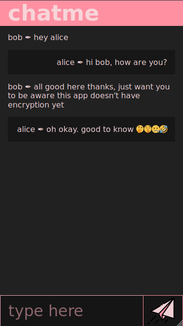

# chatme

a little experiment in writing a realtime chat application using [hypersimple](https://github.com/WebReflection/hypersimple)

it has been such fun to write that I'll keep working on it :)

----------------------------

----------------------------

## todo
- [ ] namespacing for rooms
- [ ] translation of messages so that I can communicate with family who don't speak english
- [ ] smarter local datastore
- [ ] progressive webapp - workbox?
- [ ] encryption
- [ ] wrap the app in a custom element to be included on any page with just a script tag
